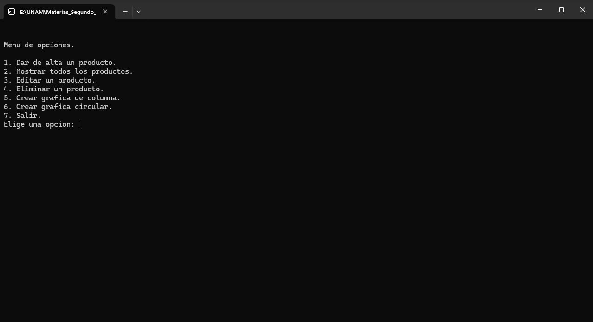
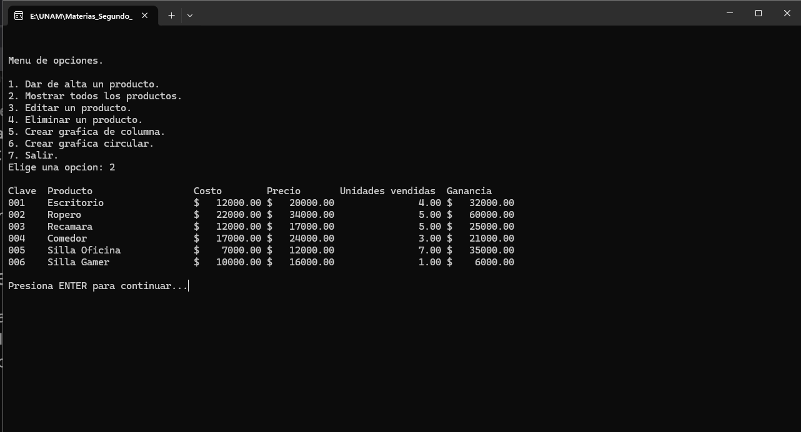
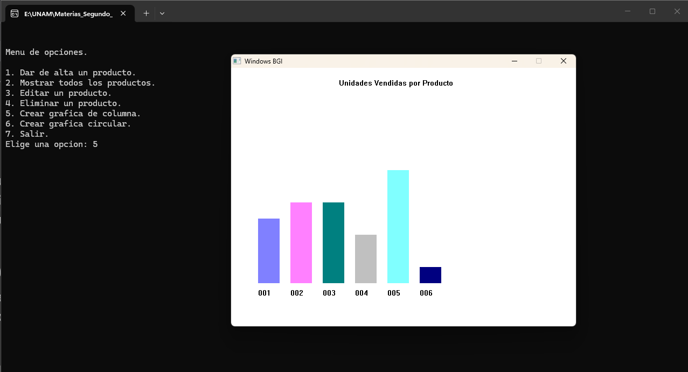
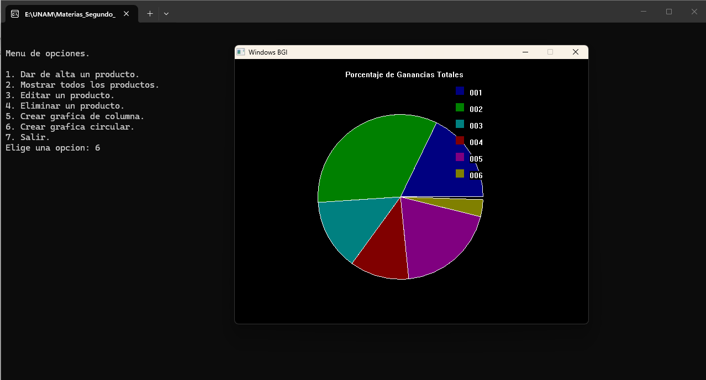

# Furniture Inventory Management System


This project is a console-based inventory management application developed in C. It serves as the final project for the Introduction to Algorithms course within the Applied Mathematics and Computing (MAC) program at UNAM. The system demonstrates secondary memory management via binary files (".dat"), full CRUD (Create, Read, Update, Delete) operations, and graphical data rendering.

  
Console interface displaying the main navigation menu and system options.

## System Architecture

The program is built using a modular architecture, separating the core logic across "main.c", "mueble.c", and "mueble.h". It leverages C "struct" definitions to manage individual product attributes such as ID, name, cost, sale price, units sold, and an active status flag.

### 1. Data Persistence
Data is not held exclusively in volatile RAM. The application ensures persistence by writing directly to binary files. During insertion or retrieval operations, the system utilizes "fwrite" and "fread" to handle memory blocks directly to and from the disk.

  
Console output rendering the registered furniture data structures and inventory status.

### 2. Logical Deletion (Soft Delete)
To protect file integrity, the system implements logical deletion rather than destroying records physically. When a user deletes a product, the program locates the record, manipulates the file cursor to step back, and overwrites the target's status to "active = 0". The runtime environment then filters out these flagged records, simulating a complete deletion.

### 3. Graphical Visualization (WinBGIm)
The project includes a statistical module that leverages the WinBGIm library to open an independent graphical window with a white background, rendering business metrics dynamically.

Bar Chart: Displays sales volume by calculating the height of each bar based on units sold multiplied by a scale factor. The rendering loop automatically assigns alternating colors to each column.

  
Graphical window rendering the automated bar chart for units sold.

Pie Chart: Visualizes the net profit distribution by calculating the percentage of "(Price - Cost) * Units Sold" for each item. The logic includes mathematical validation to filter out items with negative margins or zero sales, preventing invalid angle calculations during rendering.

  
Graphical window rendering the profit distribution pie chart.

## Execution Requirements

Due to the WinBGIm graphics library dependency, this project is designed for compilation in a Windows environment using the Code::Blocks IDE.

**Linker Settings:**
```bash
-lbgi -lgdi32 -lcomdlg32 -luuid -loleaut32 -lole32

